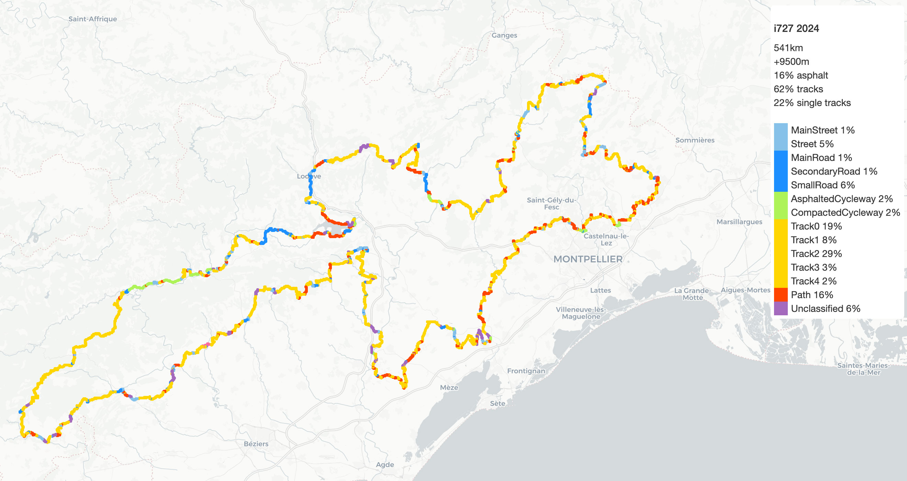

# img2gpx.py

Géolocalise des images sur un gpx, puis génère un diaporama vidéo.

Dans parameters.py, indiquez le chemin vers votre dossier images (images_folder).
Ainsi que le chemin vers votre gpx

Les autres données peuvent être enregistrées dans assets.
cover.png: l'image qui ouvre et ferme la viédo.
music.mp3: la bande son.
distance_filter: 100 mètres par défaut (distance de la trace maximale pour prendre en compte une image)
Vous pouvez indiquer d'autres noms de fichier et chemins dans parameters.py

La vidéo est générée dans le dossier _output.

# gpxcities.py

Génère le roadbook d'une trace et une cartographie avec statistiques.

