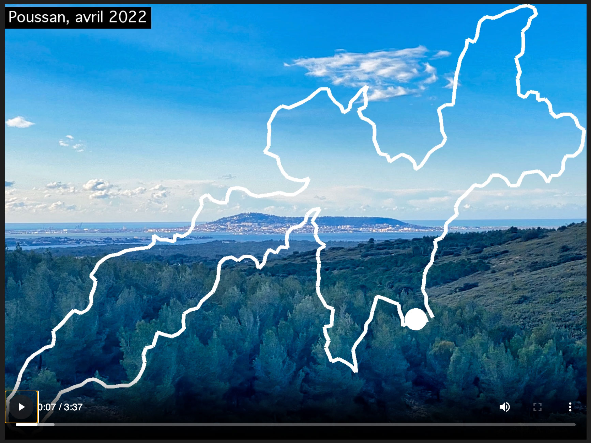
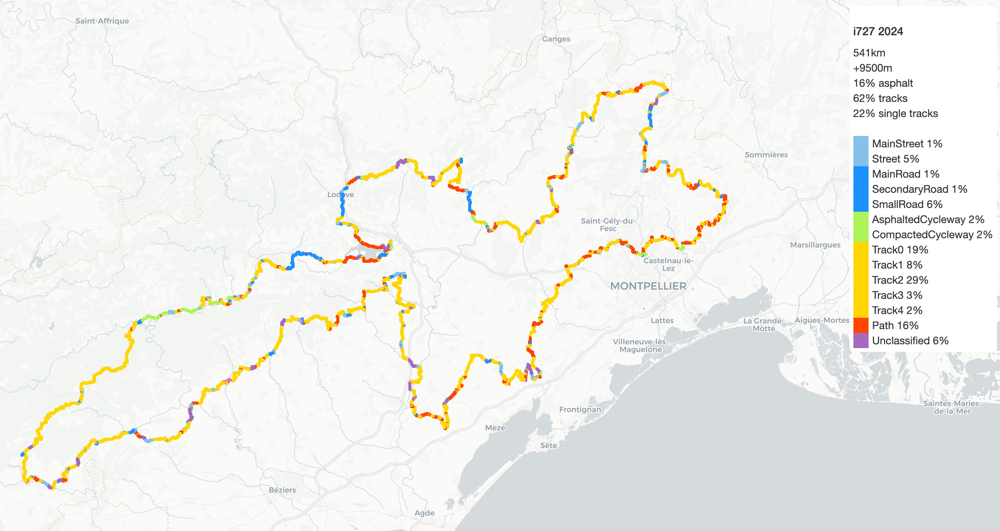

# img2gpx

img2gpx est un outil Python destiné à transformer une trace GPX et des photos géolocalisées en deux types de sorties complémentaires :

- un diaporama vidéo à partir de photos EXIF,
- un roadbook/roadbook enrichi à partir d’une trace GPX et de données OpenStreetMap.

Le projet contient trois modules principaux :

- img2gpx.py : géolocalise des photos sur une trace GPX et génère une vidéo.
- gpxcities.py : construit un roadbook, une carte et des statistiques à partir d’un GPX et d’OpenStreetMap.
- citieslink.py : enrichit le roadbook avec des liens vers les sites officiels ou Wikipédia des communes traversées.

[](https://youtu.be/KQYF0Ujdgek)

[](https://727.tcrouzet.com/static/route-727_road_book_plus.html)

## Fonctionnement général

Le flux le plus courant est le suivant :

1. Préparer un dossier d’images contenant des photos avec métadonnées EXIF GPS.
2. Définir le fichier GPX à utiliser dans le fichier de configuration.
3. Lancer le traitement pour générer soit :
   - une vidéo de diaporama,
   - soit un roadbook/cartographie,
   - soit les deux.

Les sorties sont écrites dans le dossier _output/.
Les fichiers de cache sont stockés dans _cache/.
Les logs sont enregistrés dans _logs.txt.

## Installation depuis GitHub

Sur macOS, la procédure recommande est la suivante :

```bash
git clone https://github.com/tcrouzet/img2gpx.git
cd img2gpx
python3 -m venv venv
source venv/bin/activate
pip install --upgrade pip
brew install spatialindex geos proj
pip install -r requirements.txt
```

Les dépendances système `spatialindex`, `geos` et `proj` sont nécessaires notamment pour `osmnx` et `geopandas`.

## Configuration

La configuration centrale se fait dans le fichier parameters.py.

### Paramètres à modifier

Les seuls paramètres que l’utilisateur doit généralement modifier sont les suivants :

- images_root : dossier de base contenant vos photos.
- images_folder : dossier précis contenant les images à traiter.
- gpx_file : nom du fichier GPX à utiliser.
- distance_filter : distance maximale en mètres autour de la trace pour qu’une image soit conservée.

Exemple de configuration typique :

```python
images_root = os.path.expanduser("~/Documents/GitHub/727/")
images_folder = os.path.join(images_root, "images/")

gpx_file = "_tourmagne.gpx"
distance_filter = 100
```

### Fichiers attendus dans assets

Le dossier assets/ peut contenir :

- cover.png : image d’ouverture/fermeture de la vidéo,
- music.mp3 : bande son optionnelle,
- Geneva.ttf : police utilisée pour la vidéo,
- un ou plusieurs fichiers GPX si vous souhaitez les stocker ici.

## Lancer les différents modules

### 1. Générer la vidéo de diaporama

```bash
python img2gpx.py
```

Ce script va :

- parcourir les images du dossier configuré,
- lire les informations EXIF GPS,
- retrouver la position des photos sur la trace GPX,
- créer un fichier vidéo dans _output/_video.mp4.

### 2. Générer le roadbook et la carte

```bash
python gpxcities.py
```

Ce script va :

- analyser la trace GPX,
- récupérer les communes traversées via OpenStreetMap,
- générer un roadbook Markdown et une page HTML dans _output/.

Les fichiers générés comprennent notamment :

- <nom_du_gpx>_road_book.md
- <nom_du_gpx>_road_book_plus.md
- <nom_du_gpx>.html

### 3. Enrichir le roadbook avec des liens vers les communes

```bash
python citieslink.py
```

Ce script complète le roadbook avec des liens vers les sites officiels ou Wikipédia des communes, lorsqu’ils sont disponibles.

## Conseils d’utilisation

- Les photos doivent idéalement contenir des coordonnées GPS dans leurs métadonnées EXIF.
- Le paramètre distance_filter permet de limiter le nombre d’images conservées autour de la trace.
- Si le réseau est lent ou si l’API Overpass répond mal, la génération du roadbook peut prendre du temps ; les résultats sont néanmoins mis en cache.
- La première exécution peut être plus lente car le projet télécharge et met en cache des données OSM.

## Structure du dépôt

- img2gpx.py : génération de la vidéo.
- gpxcities.py : génération du roadbook et de la cartographie.
- citieslink.py : enrichissement des liens de communes.
- parameters.py : configuration centrale.
- tools.py, osm_tools.py, cache_manager.py, network_check.py : utilitaires et accès réseau.
- assets/ : fichiers de support visuel et audio.
- _output/ : sorties générées.
- _cache/ : cache local des requêtes et traitements.

## Notes

Ce projet a été pensé pour des usages de voyage, de randonnée ou de bikepacking, où l’on souhaite automatiser la production d’un récit visuel ou d’un roadbook à partir d’une trace et de photos de parcours.

Pour toute question, suggestion ou retour d’expérience, vous pouvez ouvrir une issue sur GitHub : https://github.com/tcrouzet/img2gpx/issues